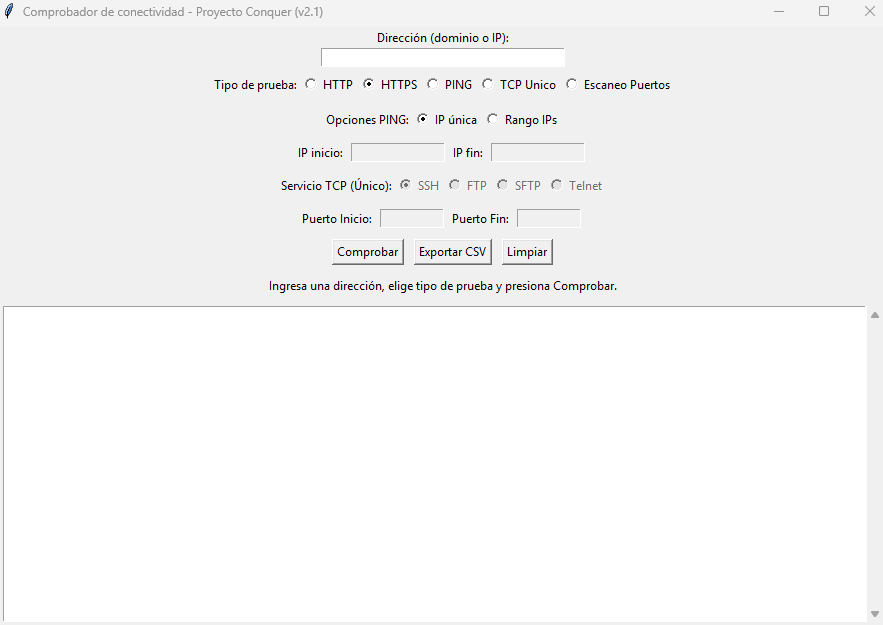

# Comprobador de Conectividad 🖧 (v2.0)

Herramienta de escritorio desarrollada en Python para el diagnóstico rápido de redes. Permite realizar pruebas de conectividad HTTP/HTTPS, PING (individual y rangos) y escaneo de puertos TCP específicos de forma sencilla a través de una interfaz gráfica (GUI).

## 🧰 Descripción del proyecto

Esta aplicación está diseñada para administradores de sistemas, desarrolladores y entusiastas de la red que necesitan verificar el estado de diferentes servicios sin recurrir a la consola de comandos.

### Novedades de la Versión 2.0:

- Puerto TCP Manual: Ahora puedes especificar cualquier puerto (1-65535) además de los servicios predefinidos.

- Protección Headless: El script detecta automáticamente si se intenta ejecutar en un entorno sin interfaz gráfica y muestra un error amigable en lugar de colapsar.

- Interfaz Expandida: Panel de resultados más amplio con soporte para scroll y etiquetas de color mejoradas.

## 📚 Características Principales

### Sin dependencias externas: Utiliza exclusivamente la biblioteca estándar de Python.

- Pruebas Web: Verificación de códigos de estado HTTP/HTTPS (200 OK, 404 Not Found, etc.).

- Diagnóstico ICMP (Ping):

    - IP única: Comprobación rápida de latencia y disponibilidad.

    - Rango de IPs: Escaneo de segmentos de red (hasta 256 IPs simultáneas).

- Escaneo de Puertos TCP:

    - Perfiles para SSH (22), FTP (21), SFTP (22) y Telnet (23).

    - Campo de Puerto Manual para probar servicios personalizados (ej. Bases de datos en el 3306, servidores web en el 8080).

- Gestión de Resultados:

    - Visualización en tiempo real con código de colores (Verde: Éxito / Rojo: Fallo).

    - Exportación a CSV para auditorías o reportes.

## 🛠️ Requisitos Técnicos

- Python 3.x instalado.

- Sistema Operativo: Windows, macOS o Linux (con soporte para X11/Tkinter).

- Librerías estándar utilizadas:

    - tkinter, urllib, ipaddress, subprocess, platform, socket, csv, sys.

## 🚀 Instalación y Uso

- Descarga el script:
    - Guarda el archivo main.py en tu ordenador.

- Ejecución:
    - Abre una terminal o consola y ejecuta:

    - python main.py

- Uso de la herramienta:

    - Introduce el dominio (ej: google.com) o la IP (ej: 1.1.1.1).

    - Selecciona el tipo de prueba.

    - Si eliges TCP, puedes seleccionar un servicio o escribir un puerto en el campo Manual.

    - Haz clic en Comprobar.

## 📸 Interfaz de Usuario

## ✍️ Autoría y Comunidad

Este proyecto forma parte de mi proceso de aprendizaje en desarrollo fullstack, adicionalmente está pensado para compartir con la comunidad (Conquer o quien lo necesite).

#### ¿Quieres contribuir?

- Nuevas Pruebas: Ideas para Traceroute o DNS Lookup son bienvenidas.

- Reporte de fallos: Si encuentras un error, abre un Issue o envía un Pull Request.

Hecho con 🔥 para la comunidad ConquerBlocks.

<!-- Python --> 

 
