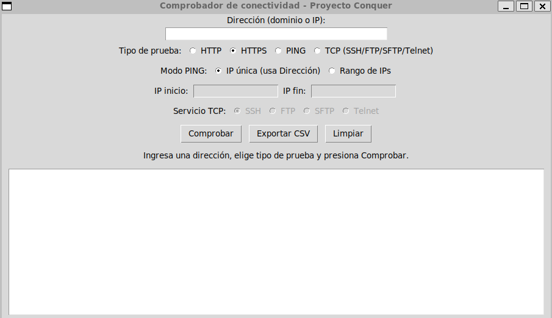

# Comprobador de Conectividad 🖧

Herramienta de escritorio en Python (Tkinter) para comprobar la conectividad de red de forma sencilla: HTTP, HTTPS, PING (único y rango de IPs) y servicios TCP (SSH, FTP, SFTP, Telnet).

---

## 🧰Descripción del proyecto

Este proyecto es una aplicación GUI escrita en Python que permite comprobar rápidamente la conectividad hacia dominios o direcciones IP, combinando varias pruebas típicas de red en una sola herramienta.

Incluye:

- Peticiones HTTP/HTTPS para verificar respuesta de sitios web.
- Ping simple a un host específico.
- Ping a un rango completo de direcciones IPv4.
- Comprobación de puertos TCP para servicios comunes de administración y transferencia.

El objetivo es disponer de una herramienta ligera, sin dependencias externas, desarrollada como parte del máster de desarrollo Full Stack en ConquerBlocks.

## 📚características

- Interfaz gráfica con **Tkinter**.
- Campo único de entrada para dominio o IP.
- Selector de tipo de prueba:
  - HTTP
  - HTTPS
  - PING
  - TCP (SSH/FTP/SFTP/Telnet)
- Modo de PING:
  - IP única (usa el campo principal).
  - Rango de IPs (`IP inicio` – `IP fin`, máximo 256 IPs).
- Resultado detallado en un área de texto:
  - Líneas en verde para resultados exitosos.
  - Líneas en rojo y negrita para errores o fallos.
- Botones de acción:
  - `Comprobar`
  - `Exportar CSV` con columnas `host,mensaje`.
  - `Limpiar` (restablece la interfaz y el modo PING a IP única).

---

## 🏗️Requisitos

- Python 3.8 o superior instalado.
- Sistemas probados:
  - GNU/Linux
  - Windows (requiere que el comando `ping` esté disponible en la consola).
- No se utilizan librerías externas, solo módulos de la biblioteca estándar:
  - `tkinter`, `urllib`, `ipaddress`, `subprocess`, `platform`,
    `socket`, `csv`.

## ⚙️ Configuración del ambiente

#### 1. Clonar el repositorio (opcional)

#### 2. Crear el entorno virtual: (opcional)
- python -m venv venv 
o
- python3 -m venv venv

#### 3. Activar el entorno virtual:
en Windows:

- venv\Scripts\activate

en linux:
- source venv/bin/activate

#### 4. Ejecución del script
- python main.py 
o
- python3 main.py

---

## 📸 Captura de Pantalla

---
## 🧊 Ejecutable
- Versión ejecutable para Windows (para hacer portable esta herramienta)
- Versión Linux próximamente

---
## ✍️ Autoría y comunidad
Este proyecto forma parte de mi proceso de aprendizaje en desarrollo fullstack, adicionalmente está pensado para compartir con la comunidad (Conquer o quien lo necesite).

Si te sirve:
- Puedes abrir Issues con dudas o mejoras.
- Puedes hacer Pull Requests con mejoras al script, documentación, etc
- Sugerencias de contribución:
    - Mejoras de interfaz.
    - Nuevos tipos de comprobaciones de red.

Hecho con 🔥 para el Máster Full Stack en ConquerBlocks

<!-- Python --> 

 

